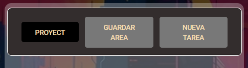
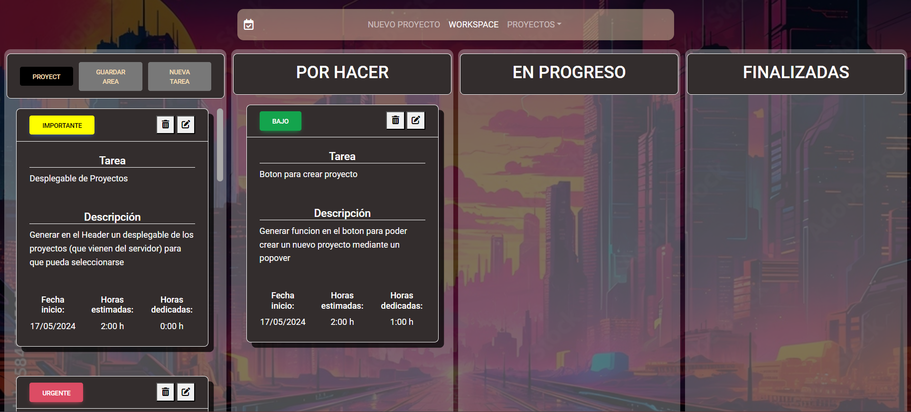

# Task Manager 
***

# Descripción
**TaskManager** es un aplicación web para gestionar tareas y optimizar el tiempo.

Se compone de la página principal o *workspace* y esta alberga los 4 espacios de trabajo principales que son:
1. **GENERADOR DE TAREAS:** aquí podremos crear nuevas tareas y guardar nuestra área de trabajo.
2. **POR HACER:** esta área estará dedicada a las tareas ya creadas pero que todavía no están empezadas.
3. **EN PROGRESO:** el área de progreso está reservada para las tareas ya creadas y que también ya están empezadas y llevan una cierta cantidad de tiempo trabajadas.
4. **FINALIZADAS:** por último, el área donde se guardarán las tareas una vez ya estén acabadas.
***

# Aspectos técnicos
1. Para la parte del *backend*, se ha utilizado `PHP` como lenguaje de programación y `Symfony v7.0` como *framework*. Se ha creado una `API RestFull` utilizando los microservicios que nos ofrece, para las peticiones y sus correspondientes respuestas.
2. En cuanto al *frontend*, se ha utilizado `Angular v17.2` como *framework* de desarrollo. Se ha utilizado `MDB Bootstrap` para el diseño y `Angular Material` para los componentes.
3. Para la base de datos, se ha utilizado `MySQL`.
4. La aplicación se ha desplegado en un servidor `Apache`.

***

# Funcionalidades
En en el menú de navegación tienes la opción de crear un nuevo proyecto, este automaticamente se incluira en la lista. También dispones de un desplegable para seleccionar el proyecto sobre el que quieras trabajar.  

En la primera columna hay disponible un "mini" navbar para crear una tarea nueva sobre el proyecto actual y guardar el area de trabajo.  

Una vez creada la tarea, haciendo "Drag&Drop", es decir haces click sobre una tarea, arrastras a otra columna y sueltas, puedes mover las atareas por las diferentes columnas libremente.

***

# Instalación
Para instalar la aplicación, sigue los siguientes pasos:
1. Clona el repositorio en tu máquina local tanto este como **[REPOSITORIO BACKEND (API)](https://github.com/magnumcrypto/taskmanager_api)**.
2. Abre una terminal y navega hasta la carpeta del proyecto.
3. Ejecuta el comando `composer install` para instalar las dependencias de Symfony.
4. Ejecuta el comando `npm install` para instalar las dependencias de Angular.
5. Crea una base de datos en MySQL con el nombre `taskmanagerdb` o bien modifica el archivo `.env` para que coincida con tu base de datos.
6. Ejecuta el comando `php bin/console doctrine:migrations:migrate` para crear las tablas en la base de datos.
7. Ejecuta el comando `aymfony server:start` para iniciar el servidor de Symfony.
8. Abre otra terminal y navega hasta la carpeta del proyecto frontend.
9. Ejecuta el comando `ng serve` para iniciar el servidor de Angular.
10. Abre un navegador y navega a `http://localhost:4200/` para ver la aplicación.
***

# Contacto

